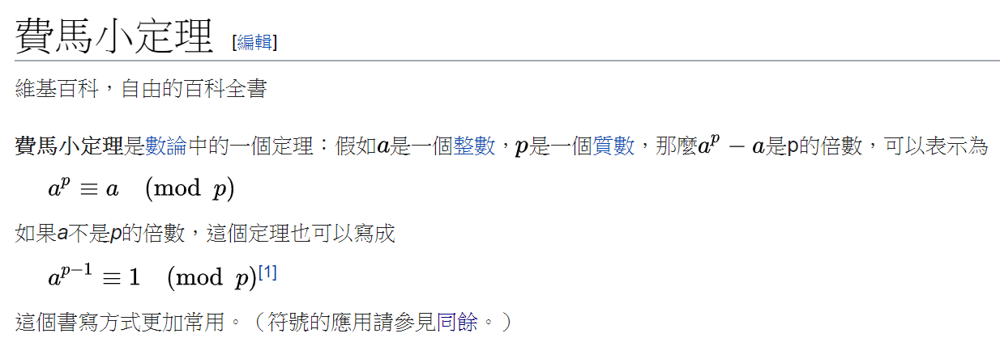

# 快速冪取模
## Description
*費馬小定理*
皮埃爾·德·費馬於1636年發現了這個定理。  
在一封1640年10月18日的信中他第一次使用了上面的書寫方式。  
在他的信中費馬還提出a是一個素數（質數）的要求。  
1736年，歐拉出版了一本名為「一些與素數（質數）有關的定理的證明」  
（拉丁文：Theorematum Quorundam ad Numeros PRIMOS Spectantium Demonstratio）」論文集，其中第一次給出了證明。  
但從萊布尼茨未發表的手稿中發現他在1683年以前已經得到幾乎是相同的證明。


## Input  Format
每筆測資輸入兩個以空格分隔的正整數 ` a 和 b `
	
## Output Format
每筆測資輸出 ` a ^ b mod 1000000007 ` (行尾換行)
(a<sup>b</sup> mod 1000000007)

## Sample Input
  - **Sample Input #1**
  > 5 3  
  
  - **Sample Input #2**
  > 2 3  
  
## Sample Output
  - **Sample Output #1**
  > 125  
  
  - **Sample Output #2**
  > 8  
  
## Scoring 
  * a,b <= 10<sup>100</sup>
  
| Subtask | Score | Constraints 
| ------- | ----- | -----------  
| 1       | 40    |  a,b <= 10<sup>15</sup> 
| 2       | 20    |  a,b <= 10<sup>30</sup> 
| 4       | 40    | 題目範圍 

## Note
  * 多筆測資
  * 能力指標: 資料型態、陣列
  * 題目ID: InfPowMod
  * 由於輸入頗大，請加入輸入優化 (參見下方範例程式碼)
```cpp
#include<iostream>
using namespace std;
int main(){
	ios::sync_with_stdio(0);cin.tie(0);
	
	return 0;
}
```

## Judging
run-time limit: 2000 ms  
memory limit: 64000000 byte  
測資數量: 5
